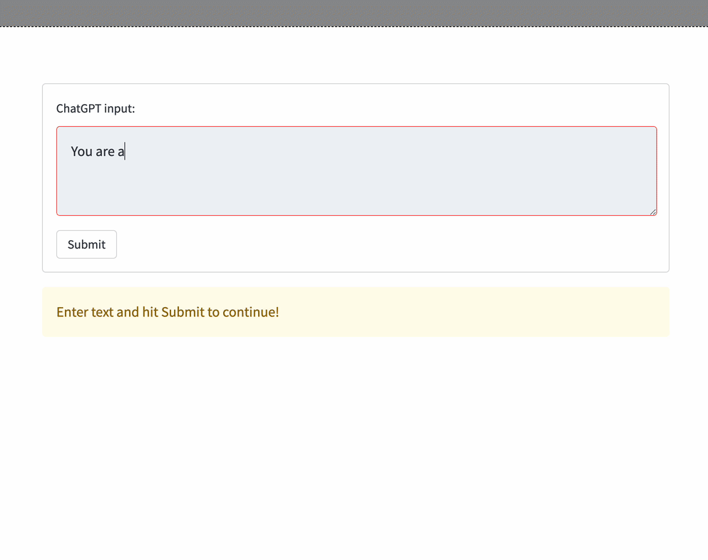

# Streamlit + OpenAI Apps

Streamlit + OpenAI API Apps for text completion and chat tasks.

[](https://myopenai.streamlit.app)



## Local Setup

- Bare Bones Speedrun [Screencast](https://www.youtube.com/watch?v=Vz-Ndhr5lYo)

Prerequisites:

- A working [Python installation](https://home.gerardbentley.com/setups/python/)
- An OpenAI API Key from [https://platform.openai.com/]
- some CLI knowledge

```sh
git clone git@github.com:gerardrbentley/streamlit-openai.git
cd streamlit-openai
python -m venv venv
. ./venv/bin/activate
python -m pip install -r requirements.txt

cp .streamlit/example.secrets.toml .streamlit/secrets.toml
# Enter API Key info into .streamlit/secrets.toml

streamlit run streamlit_app.py
```

## Version History

### Bare Bones

- [Commit Link](https://github.com/gerardrbentley/streamlit-openai/tree/caad27c6912eec3a685bdfb92b27a41178cb7721)
- Local Run: `git checkout caad27c6912eec3a685bdfb92b27a41178cb7721`
- Speedrun [Screencast](https://www.youtube.com/watch?v=Vz-Ndhr5lYo)

Just requires an `api_key` entry in `.streamlit/secrets.toml`:

```toml
api_key = "ENTER OPENAI API KEY HERE"
```

No authentication / API limits / Error Handling.

I don't recommend deploying an app like this because of the potential for a bad actor to abuse your OpenAI API key resources (your money...)

### Simple Password Auth

- [Commit Link](https://github.com/gerardrbentley/streamlit-openai/tree/67ac4286ad505fd1590cdbb00a73943cb8474cb4)
- Local Run: `git checkout 67ac4286ad505fd1590cdbb00a73943cb8474cb4`

Requires `api_key` and `user_key` entries in `.streamlit/secrets.toml`:

```toml
api_key = "ENTER OPENAI API KEY HERE"
user_key = "ENTER_A_PASSWORD_FOR_YOUR_USER_QUERY_PARAMETER"
```

Visit your app with the `user_key` in the URL query parameters to access the OpenAI API features: [http://localhost:8501/?user_key=ENTER_A_PASSWORD_FOR_YOUR_USER_QUERY_PARAMETER]()

User must pass a specified password as a query parameter to access the app.

Raises some helpful notifications on initialization if secrets aren't in order.

Limitation of all your users sharing the same pass key.
Pass key can be manually revoked if compromised by changing your streamlit secrets.

### Multi Password Auth

- [Commit Link](https://github.com/gerardrbentley/streamlit-openai/tree/4c2b42a3a04037baa96c306b6b28c60d8c7d0423)
- Local Run: `git checkout 4c2b42a3a04037baa96c306b6b28c60d8c7d0423`

Requires `api_key` and `user_keys` entries in `.streamlit/secrets.toml`:

```toml
api_key = "ENTER OPENAI API KEY HERE"
user_keys = ["ENTER_A_PASSWORD_FOR_YOUR_USER_QUERY_PARAMETER", "ANOTHER_ONE"]
```

Same usage as Simple Password Auth version, except you can enter different passwords (keys, email addresses, etc.) for different users.

### PocketBase User Auth

This version requires a username and password maintained in a database to authenticate.

[PocketBase](https://pocketbase.io) is a lightweight "backend-as-a-service" library that provides user management and optional configuration for OAuth Providers and email password resets.

It is built with golang and sqlite and can be deployed on a [fly.io](https://fly.io) VM + volume quite cheaply.

- [Commit Link](https://github.com/gerardrbentley/streamlit-openai/tree/4d0cc90898f67774473500e9288638589eada9ca)
- Local Run: `git checkout 4d0cc90898f67774473500e9288638589eada9ca`

Requires `api_key` and `pocketbase_url` entries in `.streamlit/secrets.toml`:

```toml
api_key = "ENTER OPENAI API KEY HERE"
pocketbase_url = "http://localhost:8080"
```

Run Pocketbase via Docker Locally: `docker-compose up --build`

#### Fly.io Pocketbase setup

[reference](https://github.com/pocketbase/pocketbase/discussions/537)

##### Fly CTL

Follow the installation instructions from [https://fly.io/docs/hands-on/install-flyctl/]():

```sh
curl -L https://fly.io/install.sh | sh

flyctl auth signup

fly auth login
```

##### Fly Deploy

```sh
cd user_backend
fly launch
# Follow CLI prompts to set up your app
# fly.toml created
flyctl volumes create pb_data --size=1
```

Add the following `[mounts]` section in `fly.toml` just below the top entries:

```toml file:fly.toml
app = "YOUR_APP_NAME"
kill_signal = "SIGINT"
kill_timeout = 5
processes = []

[mounts]
  destination = "/bin/pb_data"
  source = "pb_data"
```

Deploy as needed

```sh
# from ./user_backend
fly deploy
```
